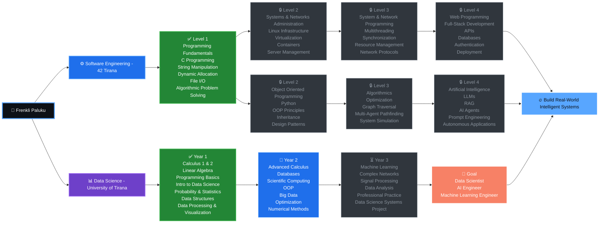

<div align="center">


</div>

---

## 🖥️ About Me

```cpp
class Frenkli {
public:
    string location   = "Tirana, Albania";
    string education  = "Data Science @ UniTirana + Software Eng @ 42 Tirana";
    string languages  = "Python | C | C++ | R";
    string focus      = "Machine Learning, Data Science & Algorithms";
    string currently  = "Building ML models & surviving 42 projects";

    void mindset() { cout << "Build → Break → Learn → Repeat" << endl; }
};
```

- 📊 Passionate about **Data Science & Machine Learning**
- ⚙️ Strong foundation in **C / C++** systems programming
- 🧠 Love algorithms, math & problem solving
- 🚀 Always building something new in public
- ☕ Powered by coffee + `printf` debugging

---

## 🛠️ Tech Stack

<div align="center">

### Languages


### Tools & DevOps


### Data Science


### Databases


### Currently Learning 🚀


</div>

---

## 🚀 Projects

<div align="center">

| Field | Project | Description | Tech | Status |
|-------|---------|-------------|------|--------|
| ⚙️ **Software Engineering \| 42 Tirana** | 🔧 **[ft_printf](https://github.com/FRENKLIP/print-f-C-Function)** | Custom `printf` from scratch — format specifiers, flags, width and precision | C | ✅ Done |
| ⚙️ **Software Engineering \| 42 Tirana** | 📚 **[Libft](https://github.com/FRENKLIP/libft)** | Custom C standard library — 40+ reimplemented functions | C | ✅ Done |
| ⚙️ **Software Engineering \| 42 Tirana** | 📥 **[get_next_line](https://github.com/FRENKLIP/get_next_line)** | Reads files line by line using file descriptors, buffers and static memory | C | ✅ Done |
| ⚙️ **Software Engineering \| 42 Tirana** | 🔁 **[push_swap](https://github.com/FRENKLIP/push_swap)** | Sorting algorithm project using two stacks and a limited set of operations | C | 🔄 Building |
| 📊 **Data Science** | 🌸 **[Iris Flower Classification](https://github.com/FRENKLIP/IrisFlower-Classification)** | KNN classification model built from scratch to understand ML fundamentals | Python | ✅ Done |
| 📊 **Data Science** | 🛫 **[TiranaFly](https://github.com/FRENKLIP/TiranaFLY)** | Data analysis and visualization project focused on aviation/passenger insights | Python, Pandas, Matplotlib | ✅ Done |
| 📊 **Data Science** | 📊 **[Data Analysis Projects](https://github.com/FRENKLIP?tab=repositories)** | Exploratory data analysis and visualizations on real-world datasets | Python, Pandas, Matplotlib | 🔄 Building |
| 📊 **Data Science** | 🧠 **[ML Experiments](https://github.com/FRENKLIP?tab=repositories)** | Classification, regression and clustering models | Python, Scikit-Learn | 🔄 Building |
| 🏙️ **App Concept** | 🏙️ **[BetterTIRANA](https://github.com/FRENKLIP/BetterTIRANA)** | Smart city idea for reporting urban problems and connecting citizens with city departments | App Concept | 💡 Idea |

</div>

> 💡 More projects dropping soon — follow to stay updated!

---

## 🗺️ Skill Tree



---

## 🌐 Connect With Me

<div align="center">

<a href="https://github.com/FRENKLIP">
  
</a>

&nbsp;

<a href="https://www.linkedin.com/in/frenkli-paluku-640a39212/">
  
</a>

<br/><br/>


</div>


<div align="center">

### 💡 "Build. Break. Learn. Repeat."

</div>
